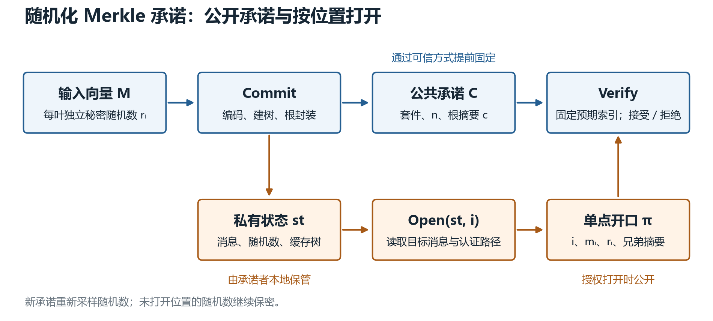
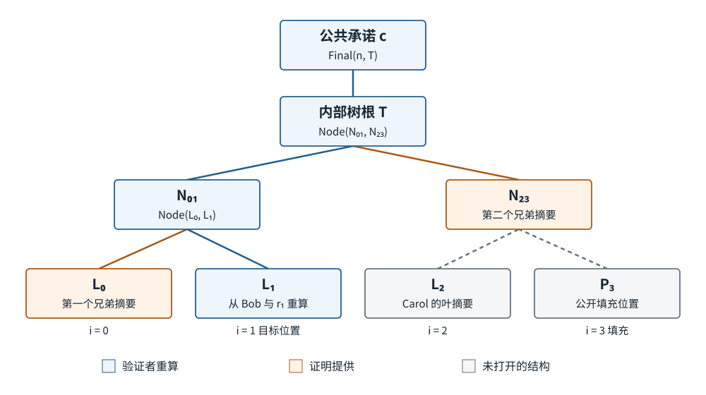
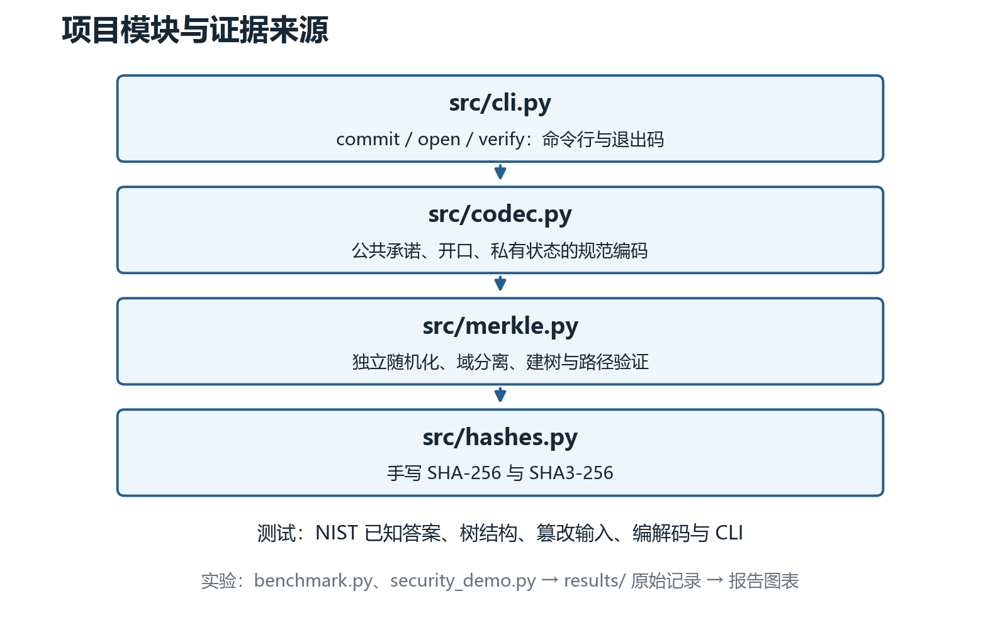
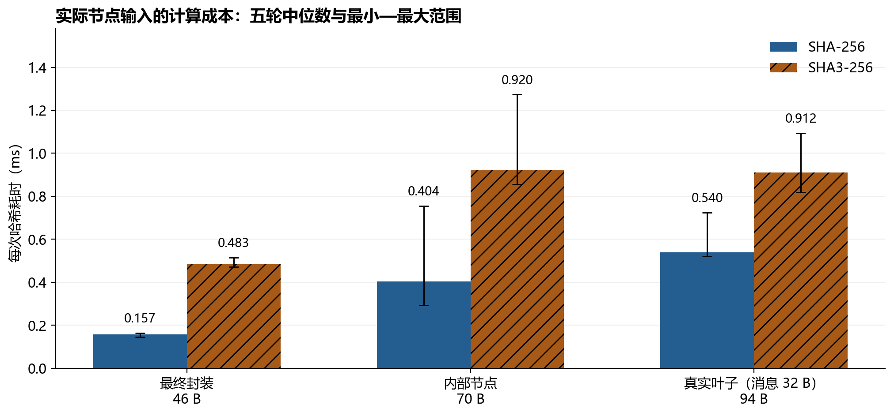
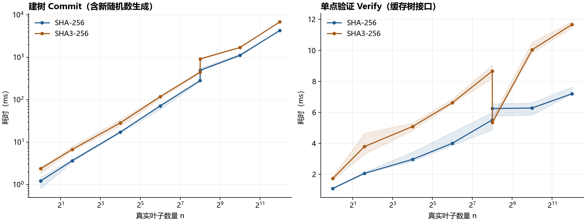

# Merkle 树承诺方案设计与安全性分析

应用密码学第一次作业技术报告

小组成员：李灿、杨赟。


**摘要**

本作业设计并实现一个支持按位置打开消息的随机化 Merkle 向量承诺。默认采用自行实现的 SHA-256，另实现 SHA3-256 作为对照。每个真实叶子使用独立的 32 字节私有随机数；叶子、内部节点、填充节点和最终承诺分别采用不同的域标记，向量长度和位置通过规范编码参与计算。方案在抗碰撞假设下具有计算 binding；在随机预言机模型、随机数独立且保密等条件下具有计算 hiding。普通确定性 Merkle 根不自动满足 hiding。

实现通过 366 组 NIST 已知答案、3 个标准示例及树结构和篡改测试。性能实验比较两种哈希在实际节点长度及不同树规模下的成本，并保存重复测量数据。结果支持在本课程的纯 Python 实现中采用 SHA-256 作为默认套件。这份报告的安全结论适用于明确模型下的经典计算攻击者；实现验证与密码安全性论证分别进行。

**关键词**：Merkle 树；向量承诺；绑定性；隐藏性；SHA-256；SHA3-256

## 1 作业要求与交付范围

截图要求设计并实现 Merkle Tree Commitment，提交具体设计文档，分析 binding 和 hiding，选择并自行实现具体密码哈希函数，验证正确性并评估性能；允许任意编程语言和 AI 辅助，但禁止调用已有哈希函数与 Merkle Tree 库或开源实现。另要求自行分组，每组 2–3 人。

| 课程要求 | 本次交付对应内容 |
| --- | --- |
| 充分调研现有实现 | 第 2 节及参考文献核验清单，覆盖规范、实际项目、论文与教学材料 |
| 具体方案设计 | 第 4 节的编码、算法、边界、接口和复杂度 |
| binding 与 hiding | 第 5 节的攻击游戏、归约思路、模型和泄露边界 |
| 哈希选择与自行实现 | 第 3、6 节；`src/hashes.py` 内两个独立手写算法 |
| 不使用已有哈希或树实现 | 核心代码零第三方依赖，测试只读取 NIST 静态测试数据 |
| 验证与性能评估 | 第 7 节；原始计时、测试日志和攻击演示可重新生成 |

这份报告采用技术报告结构，依次说明调研依据、设计决策、协议规格、安全性分析与实验结果。AI 辅助参与资料整理、编码验证及文字组织，方案结论以实际代码、标准测试数据和保存的实验记录为依据。

## 2 已有方案调研

### 2.1 研究对象与术语

Merkle 树通过逐层哈希，将许多消息压缩成一个根。公开根后，证明者可以发送目标消息和沿路径的兄弟节点，供验证者重新计算根。这是一种认证数据结构。要把它作为保密承诺，还必须回答公开根和证明是否泄露未打开的消息。

这里的对象是有序向量 M=(m₀,…,mₙ₋₁)，不是无序集合。相同消息可以出现在多个位置，不同排列应当视为不同向量。binding 的主要定义是 position binding：不能在同一承诺、同一位置成功打开两个不同消息。Catalano 与 Fiore 的工作系统研究了这一概念，并将短开口的向量承诺作为独立原语；本方案使用 O(log n) 路径，不宣称具有与 n 无关的常数长度开口。[6]

### 2.2 代表性规范与实现

| 来源与用途 | 关键实现选择 | 对本作业的启示 |
| --- | --- | --- |
| RFC 9162，Certificate Transparency | 有序叶子，叶子与内部节点采用不同前缀；按最大二次幂划分非满树；定义包含证明与一致性证明 | 可参考域分离和严谨验证规则，但其公开日志目标不提供本作业所需的消息保密性 [1] |
| Bitcoin Core | 交易标识逐层组合；奇数层复制末尾值；源码保留关于重复交易和树根歧义的说明，并进行 mutation 检测 | 不能照搬“复制最后一个节点”而忽略长度及结构歧义 [2] |
| OpenZeppelin Standard Merkle Tree | 面向合约，使用 Keccak256、ABI 编码、双重叶哈希；默认排序叶子 | 排序集合与有序向量语义不同；叶子与内部节点的输入空间必须区分 [3] |
| pymerkle 6.1.0 文档 | 支持包含与一致性证明；使用叶子和内部节点域分离；树拓扑与 RFC 9162 相关 | Python 适合表达接口与验证逻辑，但本作业不能安装或调用其实现 [4] |
| Ethereum Merkle Patricia Trie | 面向键值状态的路径压缩 trie，节点编码规则与普通二叉树不同 | 它解决键查找与状态认证，本作业不需要引入 trie 编码与复杂节点类型 [5] |

上述来源是不同应用中的代表性设计，不是兼容接口，也不是对所有“最新实现”的完整排名。开源仓库链接可能继续变化，核验清单记录实际查看的范围和路径。本次仅阅读其设计说明及相关代码，不把库函数、源文件或移植版嵌入作业实现。

### 2.3 普通树根与隐藏承诺的区别

假设只有一个成绩消息，取值为 0 至 100。若承诺是确定性编码后的哈希，接收者只需计算 101 个候选值即可查出成绩；攻击完全不需要求一般原像或寻找碰撞。即使整棵树很大，当其余消息已知时，攻击者也可以枚举剩余消息并比较根。

公开 salt 可以阻止不同对象共用同一张预计算表，却不能阻止接收者对当前对象进行枚举。为满足 hiding，本方案把随机数视为承诺者保存的秘密 opening randomness，只有打开对应消息时才公开。每个叶子必须分别采样；否则打开一个叶子后，其他叶子的随机数也随之泄露。

调研后的设计取舍是：保留通用二叉树的短包含证明；加入私有随机化；使用有序叶子和明确索引；采用可解释的二次幂填充。RFC 9162 的不平衡树能减少填充，本方案选择满二叉树是为了让路径长度与左右方向规则更直接。这是课程实现中的取舍，而不是声称满树比其他树形普遍更优。

## 3 密码哈希函数选择

### 3.1 评价标准

binding 首先要求抗碰撞性。256 位输出通常对应约 128 位的经典通用碰撞安全强度，不能把“256 位摘要”写成“256 位 binding”。本作业还需要规范清晰、可手写验证、无需特殊硬件、适合几十至几百字节短输入的算法。[9]

| 候选 | 结构及适用特点 | 本作业取舍 |
| --- | --- | --- |
| SHA-256 | 512 位分组，32 位字，64 轮；规范和测试数据完备 | 默认实现；容易审阅，适合 Python 整数位运算 [7] |
| SHA3-256 | 海绵结构；1600 位状态，1088 位 rate、512 位 capacity，24 轮置换 | 完整手写作为结构不同的对照；输出同为 32 字节 [8] |
| SHA-512/256 | 1024 位分组和 64 位字，采用专门初始化值 | 64 位平台值得考虑，但纯 Python 优势需另测；本次不实现 [7] |
| BLAKE2s 或 BLAKE2b 的 256 位输出配置 | ARX 结构，分别面向不同字长，带输出长度等参数 | 通用软件中的合理候选；多实现会增加本作业审计范围，本次只做理论比较 [10] |
| BLAKE3 | 自带分块树结构，可利用 SIMD 和线程并行 | 长消息的原生实现优势不能直接外推到短节点、单线程纯 Python [11] |
| Poseidon | 面向有限域算术及零知识证明电路 | 本作业没有电路约束，不能把电路成本低等同于 Python 字节哈希更快 [12] |

SHA-1 不适合新的抗碰撞承诺设计；NIST 的公开资料已说明其碰撞安全问题。[9] 本方案也不使用非密码散列替代密码哈希。

### 3.2 根据真实输入长度估计成本

本方案的域标记、版本和套件合计 6 字节。真实叶子输入长为 62+|m| 字节，内部节点为 70 字节，填充叶子为 22 字节，最终根封装为 46 字节。以下分组数由本方案编码与标准填充规则计算得到，是设计分析，不是外部性能实测。

```text
SHA-256 的压缩次数     = floor((L + 8) / 64) + 1
SHA3-256 的吸收置换次数 = floor(L / 136) + 1
```

| 节点输入 | L 字节 | SHA-256 压缩次数 | SHA3-256 置换次数 |
| --- | ---: | ---: | ---: |
| 填充叶子 | 22 | 1 | 1 |
| 最终封装 | 46 | 1 | 1 |
| 内部节点 | 70 | 2 | 1 |
| 32 字节消息的真实叶子 | 94 | 2 | 1 |

一次 SHA-256 压缩和一次 Keccak 置换的工作量不同。即使 SHA3-256 只需一次置换，也不能仅凭次数断言更快。SHA-256 的大端解析、32 位模运算与 SHA3 的小端 lane、64 位旋转、矩阵置换，在 Python 解释器下具有不同常数开销，因此第 7 节测量真实输入长度及整棵树。

### 3.3 长度扩展与最终选择

SHA-256 属于 Merkle–Damgård 构造，存在标准长度扩展现象；因此不能把裸 SHA-256 当作任意用途的 MAC。这里叶子含固定格式的消息长度、索引、向量长度及私有随机数，内部节点长度固定，最终比较也要求同一已发布承诺。长度扩展产生的另一个输入或摘要不能直接成为同一承诺的有效新开口，故这一现象不等于本方案 binding 被破坏。

SHA3-256 的结构不同，没有上述直接暴露完整链接状态的长度扩展方式，但它也不会自动隐藏低熵消息。两套哈希都必须采用这份报告的随机化设计。默认选择 SHA-256 的依据是标准与测试充分、手写实现容易核查，并由本机短节点实验补充验证其性能。SHA3-256 保留为可切换套件；不把两者串联，也不宣称单机结果代表所有语言和平台。

## 4 协议与数据结构

### 4.1 参数与公共语义

协议分为承诺、打开和验证三个阶段。承诺者发布公共承诺，保留含消息与随机数的私有状态；打开某个位置时，只发送该消息及其认证路径。验证者使用预先接受的公共承诺检查开口，流程如图 4-1 所示。



图 4-1 承诺、打开与验证流程。公共承诺可以提前发布；私有状态由承诺者保存；单点开口在授权打开时提供给验证者。

设 H 为套件对应的 256 位哈希，D 为字节串 `MTC1`。套件 A 的单字节编号为 `01`（SHA-256）或 `02`（SHA3-256）。`U64(x)` 表示 8 字节无符号大端整数，`||` 表示按字节连接。所有消息都先表示为 bytes；CLI 中的文字显式按 UTF-8 编码，不依赖 Python 的字符串表示或对象序列化。

公开参数包括版本、套件与向量长度 n。理论编码允许 0≤n<2⁶⁴；当前内存实现最多接收 2²⁰ 个真实叶子，且要求 62+|m|<2⁶¹ 字节以统一兼容 SHA-256 长度限制。CLI 读取的单个 JSON 文件限制为 16 MiB。资源上限不是安全强度，也不意味着已经实测过 2²⁰ 个叶子。

每次对新向量进行承诺时，独立采样 rᵢ←{0,1}²⁵⁶，调用 `secrets.token_bytes(32)` 获取操作系统随机性。该调用不用于计算摘要。随机数在打开对应消息前属于私有状态；确定性测试数据绝不能用于真实保密承诺。

### 4.2 节点的唯一编码

```text
真实叶子 Lᵢ = H(00 || D || A || U64(n) || U64(i)
                 || U64(|mᵢ|) || rᵢ || mᵢ)
填充叶子 Pᵢ = H(03 || D || A || U64(n) || U64(i))
内部节点 N   = H(01 || D || A || left32 || right32)
最终承诺 c   = H(02 || D || A || U64(n) || tree_root32)
```

这里 `00` 至 `03` 各指一个字节，而非两个 ASCII 字符。两个子节点始终各长 32 字节，顺序不可交换。真实叶子中的消息长度、32 字节随机数以及固定宽度字段使解析唯一，不会把 `(ab,c)` 与 `(a,bc)` 误认为同一个元组。四种节点的第一字节不同，因此跨类型输入不会相同；版本和套件也参与哈希。

对于 n≥1，取 h=ceil(log₂n)、p=2ʰ，将位置 n 至 p−1 填为 Pᵢ。不复制最后一个真实叶子，不排序，不删除重复消息。对于 n=0，约定 h=0、p=1，tree_root=P₀；空向量有确定的承诺，但不存在合法单点开口。对于 n=1，tree_root=L₀，路径为空，最终封装仍执行。

### 4.3 Commit 算法

输入为向量 M 和套件 A，输出公共承诺 C=(MTC1,A,n,c) 及私有状态 st。

```text
1. 校验消息类型、长度和 n 的资源限制。
2. 对每个真实叶子独立采样 32 字节 rᵢ，计算 Lᵢ。
3. 补齐 Pₙ,…,Pₚ₋₁。
4. 每一层按相邻的左、右节点计算父节点，直至只剩 tree_root。
5. 封装 c；发布 C；本地保留 M、各 rᵢ 和树的各层。
```

对同一 M 重新承诺时必须重新采样随机数。`_restore` 只用于恢复已经保存的私有状态及确定性测试，不能代替新承诺的随机化入口。空向量没有秘密消息，因此其确定性不违反这里的 hiding 定义。

### 4.4 Open 与 Verify 算法

Open(st,i) 要求 0≤i<n。开口为 π=(i,mᵢ,rᵢ,s₀,…,sₕ₋₁)，其中 s₀ 是叶子层兄弟节点，之后自下而上排列。兄弟下标为当前下标异或 1，进入上一层时将下标右移 1 位。

Verify 接收独立可信的 C、明确的预期位置 i、π，以及可选的预期消息 m。传入预期消息时，同时验证消息相等；未传入时，验证的是开口所披露的消息。

```text
1. 严格解析 C 与 π，拒绝未知版本、套件、非法字段与错误摘要长度。
2. 检查 π.index 等于预期 i，且 0≤i<C.n。
3. 检查兄弟节点恰有 h 个；每个 32 字节；随机数恰有 32 字节。
4. 用 C 的套件、n 和 π 内的消息、随机数重算 Lᵢ，记为 x。
5. 逐层处理 sⱼ：当前位置为偶数时 x=Node(x,sⱼ)，奇数时 x=Node(sⱼ,x)。
6. 每层将位置右移一位。最后计算 Final(C.n,x)，与 C.c 比较。
```

位置来自显式的验证语句，套件和 n 来自已接受的承诺，不能由证明者任意替换。验证器不接受多余路径节点，也不只检查一个重新计算出的根而忽略树高。单点验证只处理 O(log n) 个摘要，不需要读取私有状态或其余消息。

例如 n=3 时，树底层为 L₀、L₁、L₂、P₃，下一层为 N₀₁ 和 N₂₃。打开位置 2 的路径为 `(P₃,N₀₁)`：先计算 Node(L₂,P₃)，再计算 Node(N₀₁,N₂₃)，最后封装为 c。`test_manual_three_leaf_construction` 对这个例子独立展开公式核验。



图 4-2 位置 1 的单点认证路径。蓝色表示验证者复算的节点，橙色表示开口提供的兄弟摘要。验证只需目标消息、其随机数及两个兄弟摘要；填充节点 P₃ 保持公开的结构语义。

### 4.5 完整打开与传输格式

完整打开会释放全部消息及随机数。`verify_all` 重新构建承诺并比较，支持空向量；释放后相应消息不再隐藏。公共 JSON 仅包含版本、套件、n、摘要；开口 JSON 包含对应位置、消息、随机数和路径。JSON 中字节串使用小写十六进制。解析器拒绝重复键、额外字段、布尔值冒充整数、非法 hex 和非有限数值。

私有状态 JSON 保存全部消息与随机数，恢复时重建并校验承诺。文件自身没有加密或身份认证，必须由承诺者保管，不得随公共承诺发送。恢复时检测不一致不等于能够抵抗同时改写整个状态的攻击者。

另提供可实测的紧凑二进制编解码：公共承诺为 `MTC1(4) || A(1) || n(8) || c(32)`，总长 45 字节。单点开口为 `i(8) || message_length(8) || message || salt(32) || h(1) || siblings`，总长 49+|m|+32h 字节。开口使用其对应承诺的版本，不在开口中另加魔数。只有摘要 c 本身是 32 字节，不能混淆“根摘要大小”与“完整传输对象大小”。

### 4.6 复杂度与空间

令 B=Σ|mᵢ|。建树耗时 O(B+p)，对 n≥1 有 p<2n，因此也可写为 O(B+n)。完整缓存有 2p−1 个节点，摘要字节负载为 32(2p−1)，另有 32n 字节随机数和 B 字节消息；Python 对象与容器还会带来额外开销。

不计消息传输与序列化，缓存树上的 Open 取出 h 个摘要，耗时 O(log n)。Verify 需要 h+2 次哈希调用，其中叶子哈希处理整条消息，所以耗时是 O(|m|+log n)。建树总调用次数恰为 p+(p−1)+1=2p，包括最终封装。二次幂填充会使 n 从 256 增至 257 时，p 从 256 跳到 512；这是后续性能台阶的结构原因。

当前 CLI 将私有状态存为消息与随机数，每次 `open` 会先重建树。因此 CLI 整体打开一次是 O(B+n)，而进程内 `tree.open(i)` 是 O(log n)。基准测试明确测量后者，不能将缓存 API 的开口时间当成磁盘文件恢复时间。

## 5 安全性分析

### 5.1 威胁模型与正确性

承诺者可能试图在承诺后改变消息；接收者可能选择已知低熵候选并试图提前获知承诺内容。算法、套件、n 和公开根都不是秘密。攻击者可见已授权的开口及兄弟摘要，但不能读到未授权叶子的私有随机数。本分析假设接收者事先通过可靠方式获得 C，并固定其版本、套件与 n。

正确性来自逐层归纳：诚实开口从原始 Lᵢ 出发，每次与存储时相同的兄弟节点按相同方向组合，故每一层都等于建树时的对应节点，最终重现 c。空路径的 n=1 情况同样成立；n=0 用完整打开验证。

### 5.2 Position binding 的游戏

固定允许的套件。攻击者输出 C、位置 i 和两个开口 π、π′。当且仅当两个开口在同一 C、同一预期 i 下均验证成功，而且打开的消息 m≠m′，攻击者获胜。仅找到不同随机数但相同消息，不属于这里定义的消息 binding 破坏。

假设上述攻击成功。比较两条验证计算轨迹，记其叶子摘要为 x₀、x′₀：

1. 若 x₀=x′₀，则两条叶子输入不同，因为消息不同且编码唯一；两条不同输入得到相同 H 输出，直接得到哈希碰撞。
2. 若 x₀≠x′₀，沿两条路径向上比较。若某层首次出现相等输出，则上一层不同的目标子值处在由同一 i 决定的相同左右位置，所以父节点输入不同、输出相等，再次得到碰撞。攻击者改变兄弟节点也无法使含不同目标子值的有序输入对完全相同。
3. 若两条路径的 tree_root 始终不同，但最终都验证为同一 c，那么最终封装的两个不同输入产生相同摘要，仍是碰撞。

因此，存在成功的双开攻击就能从其轨迹中提取一个 H 的碰撞。归约不要求诚实生成的 C，也不依赖随机数保密。使用同一安全套件和规范解析时，破坏 position binding 不比寻找哈希碰撞容易；理想 256 位摘要的通用生日攻击成本约为 2¹²⁸。[9]

完整向量 binding 也成立：若同一 C 的两个完整打开给出不同向量，则至少有一个位置的消息不同，或者向量长度不同。同长度时可沿对应树路径抽取碰撞；不同长度时 n 已是公共承诺的一部分，且参与最终封装，无法作为同一公共对象直接混用。索引和长度还使顺序、重复消息及填充语义清晰。

以上是抗碰撞假设下的条件性论证，有限次数的篡改测试不能证明该假设。固定 SHA-256 或 SHA3-256 是对抽象哈希原语的具体实例化，并不意味着已经从数学上证明其抗碰撞。

### 5.3 为什么抗碰撞性本身不能推出 hiding

对确定性承诺，接收者可以自行计算两个候选向量的承诺并比较，立即区分它们。加入随机数后，也不能只写“哈希不可逆，所以隐藏”。一般单向性和抗碰撞性允许函数泄露输入的某些位。

例如取一个输出 255 位的抗碰撞函数 G，构造 H(x)=G(x)||last_bit(x)。新函数仍抗碰撞，但主动泄露最后一位。对本方案 n=1 且非空消息，叶子输入最后一位来自消息；最终封装的最后一位又来自叶摘要，所以这类 H 仍可泄露消息位。该反例说明抗碰撞性质无法单独支撑隐藏证明。随机预言机承诺及这种假设差异也是相关课程材料讨论的重点。[13]

### 5.4 Hiding 游戏与随机预言机论证

先考虑没有开口的标准隐藏游戏。攻击者选择两个向量 M₀、M₁，要求 n 相同；这份报告进一步限定对应消息长度相同，以排除长度及运行时间等附带渠道。挑战者随机选择 b∈{0,1}，对 M_b 使用独立均匀随机数执行 Commit，只向攻击者返回 C。攻击者输出猜测 b′，隐藏优势定义为 `|Pr[b′=b]−1/2|`。

在随机预言机模型中，只要攻击者没有查询某个真实叶子的完整输入，该叶摘要就可以看作与其消息无关的均匀随机值。把所有未查询的真实叶摘要替换为这样的随机值后，内部树和最终承诺只是这些值及公共结构的确定性函数，因此两组候选消息得到的公共视图分布相同。

攻击者能够破坏这个论证的关键事件，是猜中某个秘密叶子的完整哈希输入，尤其是其中独立的 256 位随机数。设 u 为仍受保护的叶子数，q 为攻击者随机预言机查询数；对经典、多项式查询攻击者，用逐叶 hybrid 和并合界可以给出量级为 O(uq/2²⁵⁶) 的保守区分界。这个表达是模型中的量级上界，不是现实攻击成功率测量，也不是紧致常数估计；公开且不同的索引还可避免把所有叶子误看成同一个不带标签的盐目标。

因而在该模型和新鲜秘密随机数条件下，方案具有计算隐藏性。实际代码以 SHA-256 或 SHA3-256 替代随机预言机，这是明确的建模假设；本文不从抗碰撞性单独推导真实哈希的 hiding，不把此性质描述为信息论或完美隐藏。

### 5.5 部分打开后的保护范围

允许攻击者获得部分开口时，可比较两组向量在已打开位置取值相同、未打开位置可能不同的游戏。已打开叶子的随机数可以公开，因为其余随机数是独立采样的。兄弟节点可能恰好是一个未打开叶子的摘要，但攻击者仍需猜测该叶子的秘密随机数才能做有效字典比较。前述 hybrid 思路可用于这种受限的部分打开视图。

这不表示已打开消息不会在语义上透露其他消息。例如两条记录本身相等或由公开关系确定时，打开其中一条就可能揭示另一条。这种应用侧相关性不由密码树消除。这份报告也不宣称已经证明针对任意相关消息分布的通用可模拟 selective-opening 安全性。

所有叶子共用一个随机数是不安全的取舍：打开一个叶子就公开该随机数，如果路径中还包含另一个叶子的摘要，便可直接枚举其低熵消息。将整棵树仅用一个秘密随机数再包一层，也难以同时满足可公开验证的部分打开和剩余叶子保密。本实现因此选择每叶独立随机化。

### 5.6 泄露、信任与适用边界

| 可观察信息或风险 | 本方案的保证边界 |
| --- | --- |
| 版本、套件、n、树高和证明大小 | 明确公开，不提供向量长度隐藏 |
| 被打开的索引、消息、长度和随机数 | 按设计公开；之后不再要求该消息 hiding |
| 未打开叶子和子树的摘要 | 在随机预言机及随机数保密前提下不额外泄露候选内容 |
| 私有状态泄露、随机数复用或熵不足 | hiding 前提失效，不能靠根哈希补救 |
| 攻击者同时替换公共根与证明 | Merkle 验证没有外部真实性来源；需事先固定可信承诺 |
| 回滚到旧承诺、消息来源和发布时间 | 不由本方案认证；应用需另行约定版本接受规则与可信传递方式 |
| 隐藏子树是否全都格式正确、全部数据是否可用 | 单点路径不证明整棵隐藏树的规范性或可用性；完整打开可检查本构造 |
| Python 运行时间、内存与秘密擦除 | 未实现常数时间或可靠秘密擦除；模型不包含本机侧信道 |

## 6 实现说明

### 6.1 模块与接口

实现按照“命令行接口—传输编码—承诺协议—密码哈希”划分职责。哈希计算位于最底层，由本地代码完成；测试与实验脚本通过相同的公开接口调用核心实现，如图 6-1 所示。



图 6-1 模块职责与主要调用关系。实线表示主要依赖方向；CLI 也直接调用承诺接口。底部列出提供正确性与性能证据的测试和实验脚本。

| 文件 | 内容 |
| --- | --- |
| `src/hashes.py` | 手写 SHA-256、Keccak-f[1600] 与 SHA3-256 |
| `src/merkle.py` | 随机化建树、单点开口、单点验证、完整打开验证 |
| `src/codec.py` | 严格 JSON、紧凑二进制、私有状态恢复 |
| `src/cli.py` | `commit`、`open`、`verify` 命令行接口 |
| `tests/` | NIST 已知答案、边界、攻击性输入与端到端测试 |
| `scripts/` | 基准、攻击演示、测试日志、图表和报告生成 |

核心实现和验证运行不依赖第三方包。标准库仅用于类型数据结构、随机字节、文件及 JSON、计时和测试等通用功能；没有调用 `hashlib`、`hmac`、加密扩展或外部命令计算摘要，也没有引用现成 Merkle Tree 实现。绘图脚本可选使用 Matplotlib，它不参与承诺算法。

```python
tree = MerkleCommitment([b"Alice", b"Bob", b"Carol"], suite="sha256")
public = tree.commitment
proof = tree.open(1)
ok = verify(public, proof, expected_index=1, expected_message=b"Bob")
```

### 6.2 手写 SHA-256

实现按 FIPS 180-4 完成消息填充、分组、大端字解析、消息扩展、64 轮压缩和状态累加。[7] 模运算通过位掩码限制在 32 位内。代码显式拒绝非 bytes 输入，避免把字符串编码等不确定行为混入哈希定义。填充时保存原消息比特长度，重点测试 55、56、63、64 字节及多分组情况。

实现提供一次性摘要 API，不支持增量文件流；会为填充数据分配额外内存。这满足本作业以短叶子和节点为主的实验目标，大文件应用可在保持协议不变的情况下增加自行实现的流式接口。

### 6.3 手写 SHA3-256

实现使用 25 个 64 位 lane，索引为 x+5y。逐轮实现 θ、ρ、π、χ、ι，并以小端序吸收消息。rate 为 136 字节，输出只需第一段 32 字节，无需额外挤出置换。[8,17]

字节对齐消息的后缀和填充处理为首个填充字节 `06`、末字节设置最高位；当只剩一个填充字节时合并为 `86`。因此 SHA3-256 不是 Ethereum 的 Keccak256，不能因为都基于 Keccak 就把两者摘要互换。NIST 短消息向量覆盖 135 和 136 字节；长消息向量覆盖到 13,836 字节，验证多次吸收的正确性。

### 6.4 工程边界与错误处理

构造函数拒绝字符串消息、非列表向量、不支持的套件及超范围参数。解码器验证字段集合和二进制剩余长度，避免默默接受多余字节。CLI 使用独占创建，已存在的输出文件不会被覆盖；输入、公有输出和私有状态必须为不同路径。输出序列化后也检查 16 MiB 上限，避免生成自身无法重新读入的私有状态。验证成功退出码为 0，语义验证失败为 1，解析或输入错误为 2。

单点验证必须显式给出预期位置，可选给出预期消息。仅验证证明里自带的位置而不检查调用者真正要求的位置，会产生“证明有效但不是所要求的记录”的应用错误，因此 API 特意将预期位置设为必填参数。

## 7 验证与性能评估

### 7.1 已知答案与功能测试

所有预期摘要来自 NIST 发布的测试数据或计算示例，不是由本实现生成后再反过来校验自身。[14–16] 使用公开测试向量验证不等于获得 NIST CAVP 认证。

| 项目 | 实测结果 |
| --- | --- |
| 测试方法数 | 23 |
| 失败与错误 | 0 / 0 |
| NIST 已知答案总数 | 366 |
| 附加标准示例 | 3 |
| 测试运行时间 | 15.029 秒 |
| 原始证据 | results/tests.txt 与 results/tests.json |

已知答案测试覆盖 SHA-256 的短、长消息以及 SHA3-256 的短、长消息，共 366 组，另有 3 个标准示例。功能测试对 n=0…33、63、64、65、127、128、129 的所有真实位置，在两种套件下检查开口，共 2,274 条合法路径；同时检查空向量、单叶、中文、空消息、二进制消息、重复数据与完整打开。

负向测试修改消息、随机数、索引、树长、套件、承诺摘要、兄弟节点、路径顺序及路径长度，并检查非法 JSON、重复键、额外字段和二进制尾随数据。手工展开的三叶公式作为树构造的额外检查，避免只依赖建树与验证共享逻辑的自洽性。

### 7.2 可运行攻击演示

| 实验 | 观察结果 |
| --- | --- |
| 不加随机数的成绩承诺 | 枚举第 74 个候选恢复 73 |
| 提前公开随机数 | 枚举第 74 个候选恢复 73 |
| 每叶共用随机数并打开一叶 | 利用该随机数和兄弟叶摘要恢复 73 |
| 不同叶随机数，用已公开的另一个随机数猜测 | 101 个候选均未匹配；仅为受限负对照 |
| 将随机数减为 8 位 | 1993 次查询恢复消息 73 和随机数 19 |
| 复制末尾的朴素树 | [A,B,C] 与 [A,B,C,C] 根相同 |
| MTC1 对同样两组向量 | 根摘要不同 |
| 篡改开口消息 | 验证拒绝 |

这些实验用于说明具体失败模式。尤其是“用另一个叶子随机数猜测失败”，只排除了演示中这一种受限攻击，不构成 hiding 证明；安全结论依赖第 5 节的模型与论证。8 位随机数实验也只是展示熵不足的后果，真实方案采用 256 位随机数。

### 7.3 测量方法与环境

| 环境项 | 记录值 |
| --- | --- |
| CPU | 12th Gen Intel(R) Core(TM) i5-12500H |
| 操作系统平台标识 | Windows-10-10.0.26200-SP0 |
| Python | 3.11.7 / packaged by Anaconda, Inc. / (main, Dec 15 2023, 18:05:47) [MSC v.1916 64 bit (AMD64)] |
| 逻辑 CPU 数 | 16 |
| 进程数 | 1 |
| 测量时间 UTC | |

每个案例先预热一次，再做 5 轮重复，报告中位数并保留每轮原始样本。定时器为 `perf_counter_ns`，计时期间关闭循环垃圾回收；对象分配和普通引用计数回收仍会发生。单进程、单线程运行，不使用本机优化哈希库或 SIMD。数据生成和磁盘写入在计时区间之外。

微基准输入覆盖 0、32、46、55、56、62、64、70、94、119、120、135、136、137、1024、4096、65536 字节。每轮循环次数随长度调整，详情保存在 JSON。树实验使用相同的 32 字节索引消息，规模为 1、3、16、64、256、257、1024、4096。Commit 包括生成新随机数；Open 和 Verify 使用已缓存树，Verify 包括消息哈希和最终封装。

结果属于该机器、该解释器、该版本手写代码的一次测量。操作系统调度、频率及固定的测试顺序会产生噪声；不依据这些数字判断算法的密码强度，也不把它们当作 C、Rust、硬件加速库的性能排名。

### 7.4 哈希函数实测

| 输入字节数 | SHA-256 ms | SHA3-256 ms | SHA3 与 SHA-256 耗时比 |
| --- | --- | --- | --- |
| 46 | 0.1567 | 0.4831 | 3.08 |
| 55 | 0.1580 | 0.5092 | 3.22 |
| 56 | 0.3085 | 0.4803 | 1.56 |
| 70 | 0.4042 | 0.9202 | 2.28 |
| 94 | 0.5397 | 0.9116 | 1.69 |
| 119 | 0.5655 | 0.8703 | 1.54 |
| 120 | 0.7893 | 0.8398 | 1.06 |
| 135 | 0.8684 | 0.8918 | 1.03 |
| 136 | 0.7711 | 1.6464 | 2.14 |
| 137 | 0.8236 | 1.7887 | 2.17 |
| 1024 | 5.0050 | 6.8393 | 1.37 |
| 65536 | 269.4487 | 423.3213 | 1.57 |

在内部节点的 70 字节输入上，SHA3-256 的中位耗时约为 SHA-256 的 2.28 倍；在真实 32 字节消息对应的 94 字节叶子输入上，约为 1.69 倍。这支持本实现选择 SHA-256。55→56、119→120 和 135→136 字节附近分别涉及不同算法的额外压缩或吸收块；实际跳变还叠加系统噪声，不能将所有时间变化都归因于分组数。



图 7-1 实际节点长度下的哈希成本。柱高为五轮测量中位数，误差线表示最小值至最大值；该范围描述本轮测量波动，不表示统计置信区间。32 字节消息的真实叶子输入长 94 字节。

### 7.5 建树与开口实测

| 套件 | n | 填充后 p | Commit ms | Open μs | Verify ms | 完整开口 B |
| --- | --- | --- | --- | --- | --- | --- |
| sha256 | 1 | 1 | 1.214 | 2.88 | 1.088 | 81 |
| sha3-256 | 1 | 1 | 2.366 | 2.60 | 1.731 | 81 |
| sha256 | 3 | 4 | 3.652 | 3.77 | 2.059 | 145 |
| sha3-256 | 3 | 4 | 6.723 | 3.48 | 3.790 | 145 |
| sha256 | 16 | 16 | 17.270 | 3.84 | 2.966 | 209 |
| sha3-256 | 16 | 16 | 28.484 | 3.78 | 5.085 | 209 |
| sha256 | 64 | 64 | 71.595 | 4.01 | 4.005 | 273 |
| sha3-256 | 64 | 64 | 118.549 | 4.84 | 6.623 | 273 |
| sha256 | 256 | 256 | 282.761 | 5.06 | 5.511 | 337 |
| sha3-256 | 256 | 256 | 444.697 | 4.38 | 8.663 | 337 |
| sha256 | 257 | 512 | 495.700 | 5.50 | 6.242 | 369 |
| sha3-256 | 257 | 512 | 921.526 | 2.82 | 5.339 | 369 |
| sha256 | 1024 | 1024 | 1117.725 | 5.34 | 6.279 | 401 |
| sha3-256 | 1024 | 1024 | 1701.962 | 4.93 | 10.040 | 401 |
| sha256 | 4096 | 4096 | 4298.484 | 5.36 | 7.196 | 465 |
| sha3-256 | 4096 | 4096 | 6861.847 | 5.31 | 11.667 | 465 |

4096 叶子时，SHA-256 与 SHA3-256 的建树中位耗时分别为 4.298 秒和 6.862 秒，后者约为前者 1.60 倍。对应单点验证分别为 7.196 ms 和 11.667 ms。缓存开口只复制路径摘要，不重新做密码哈希，所以耗时远低于验证。建树总体随填充后容量增长，而验证随树高增长；个别规模的测量并不单调，不能隐藏或平滑掉这些噪声。从 256 到 257 时缓存容量翻倍，额外填充叶子与内部节点解释了建树成本的明显上升。

针对原始测量中 SHA3-256 在 n=257 时验证反而更快的异常，另外执行了 5 轮、每轮 40 次的局部复测。n=256 与 n=257 的中位数分别为 5.143 ms 和 9.577 ms。复测与主测存在明显差异，说明当时的执行环境并不稳定；没有采集 CPU 频率或调度跟踪，不能确定具体原因。原始数据未被替换，复测单列于 results/benchmark_diagnostic.json，可用 scripts/timing_diagnostic.py 重现。所以本文仅将复杂度和总体趋势作为可解释结论，不把个别点或小幅比值当作稳定常数。



图 7-2 建树与单点验证耗时。折线为 5 轮中位数，阴影为最小值至最大值；横轴为对数刻度，建树耗时纵轴也为对数刻度。输入消息长 32 字节，测试的是缓存树接口。

实验中的根摘要均为 32 字节，完整公共承诺二进制均为 45 字节。n=4096 时 h=12，认证路径为 384 字节，含 32 字节消息的完整开口为 465 字节。SHA-256 与 SHA3-256 在本方案中的证明大小完全相同，差别主要是计算成本。

树节点及随机数的存储按精确字节负载计算：n=4096 时节点摘要为 262,112 字节，随机数为 131,072 字节，消息为 131,072 字节，合计 524,256 字节。该数字不包含容器、对象头、公共承诺对象及计算临时缓冲区；不是 Python 实际峰值内存或进程 RSS 的测量结果。

## 8 复现步骤与交付说明

在项目根目录使用 Python 3.11 或更新版本执行以下命令，核心程序无需安装包：

本机目录示例为 `D:\PostGraduate\应用密码学\第一次作业`。从 GitHub 克隆或解压到其他目录时，进入包含 `src`、`tests` 和 `README.md` 的项目根目录即可，代码本身不依赖这一绝对路径。

```powershell
python scripts/run_tests.py
python scripts/security_demo.py
python scripts/benchmark.py
python scripts/demo.py
```

其中测试向量已经附在 `tests/vectors/`，测试和运行无需联网。`research/测试向量来源.md` 记录官方来源，`research/references-verified.json` 记录调研来源及用途。基准脚本默认 5 轮、最大 4096 叶子；较慢机器可使用 `--max-n 1024`，但新输出必须与这份报告默认结果区分。

使用自有 JSON 字符串数组承诺、打开和验证的示例：

```powershell
python -m src.cli commit examples/messages.json --public public.json --state private.json
python -m src.cli open private.json --index 1 --out opening.json
python -m src.cli verify public.json opening.json --index 1 --message Bob
```

`public.json` 可发送给接收者，`private.json` 包含全部消息和随机数，应留在承诺者本地。只在需要打开时发布对应 `opening.json`。切换 SHA3-256 可在 commit 命令加 `--suite sha3-256`；不能在验证时擅自替换套件。再次运行时请使用新文件名，以保留已有承诺与私有状态。

文档中的源码路径与命令均对应实际交付。演示样本使用公开的示例消息；可复现的固定随机数样本会明确标注为测试专用。报告中的所有性能数字均从保存的实验结果生成，不填充估计或预设数据。

## 9 结论与可扩展方向

本方案把随机化单消息承诺与有序 Merkle 认证路径组合，取得常数长度根摘要和对数长度单点路径。独立私有随机数解决低熵消息的直接字典攻击，域分离与规范编码避免叶子、内部节点、填充及元数据的混淆。binding 与 hiding 分别依赖抗碰撞假设和更强的随机预言机建模，二者不能混为一谈。

在本作业的约束下，Python 能完整表达算法且便于核验；相同规范在其他语言中的正确摘要、承诺和证明字节应当相同，但运行时间可能明显不同。因此选择 Python 是实现透明度与课程规模之间的取舍，并非声称不同语言没有性能差异。默认 SHA-256 的选择同时考虑可实现性和本机测量，SHA3-256 提供可运行的对照。

后续可以研究不填充的 RFC 风格树、多开口共享路径、持久化节点缓存及流式哈希，以降低额外节点、批量证明和大文件成本。它们会改变编码或工程行为，需要独立定义并验证；当前实现不宣称已经提供这些功能。

## 参考文献

[1] Ben Laurie, Eran Messeri, Rob Stradling. [RFC 9162 Certificate Transparency Version 2.0](https://www.rfc-editor.org/rfc/rfc9162.html). RFC Editor, 2021.

[2] Bitcoin Core developers. [Bitcoin Core src/consensus/merkle.cpp](https://github.com/bitcoin/bitcoin/blob/master/src/consensus/merkle.cpp). Official GitHub repository, master branch observed at access time.

[3] OpenZeppelin. [OpenZeppelin merkle-tree](https://github.com/OpenZeppelin/merkle-tree). Official GitHub repository README.

[4] pymerkle project. [pymerkle 6.1.0 documentation](https://pymerkle.readthedocs.io/en/latest/). Project documentation.

[5] ethereum.org contributors. [Merkle Patricia Trie](https://ethereum.org/developers/docs/data-structures-and-encoding/patricia-merkle-trie/). Ethereum developer documentation.

[6] Dario Catalano, Dario Fiore. [Vector Commitments and their Applications](https://eprint.iacr.org/2011/495). PKC 2013; full version ePrint 2011/495, revised 2012, 2013.

[7] NIST. [FIPS PUB 180-4 Secure Hash Standard](https://nvlpubs.nist.gov/nistpubs/FIPS/NIST.FIPS.180-4.pdf). NIST FIPS, 2015.

[8] NIST. [FIPS PUB 202 SHA-3 Standard Permutation-Based Hash and Extendable-Output Functions](https://nvlpubs.nist.gov/nistpubs/FIPS/NIST.FIPS.202.pdf). NIST FIPS, 2015.

[9] NIST CSRC. [Hash Functions](https://csrc.nist.gov/projects/hash-functions). NIST Hash Functions project.

[10] Markku-Juhani O. Saarinen, Jean-Philippe Aumasson. [RFC 7693 The BLAKE2 Cryptographic Hash and Message Authentication Code](https://www.rfc-editor.org/rfc/rfc7693.html). RFC Editor, 2015.

[11] BLAKE3 team. [BLAKE3 specifications and design rationale](https://github.com/BLAKE3-team/BLAKE3-specs). Official BLAKE3 specifications repository.

[12] Lorenzo Grassi, Dmitry Khovratovich, Christian Rechberger, Arnab Roy, Markus Schofnegger. [Poseidon A New Hash Function for Zero-Knowledge Proof Systems](https://eprint.iacr.org/2019/458). IACR ePrint 2019/458, 2019.

[13] Purdue University CS 555 course materials. [CS 555 Topic 14 Random Oracle Model and Hashing Applications](https://www.cs.purdue.edu/homes/jblocki/courses/555_Spring17/slides/Lecture14.pdf). University course lecture slides, Spring17 directory, 2017.

[14] NIST CSRC. [Cryptographic Algorithm Validation Program Secure Hashing](https://csrc.nist.gov/projects/cryptographic-algorithm-validation-program/secure-hashing). NIST CAVP.

[15] NIST. [SHA-256 worked examples](https://csrc.nist.gov/CSRC/media/Projects/Cryptographic-Standards-and-Guidelines/documents/examples/SHA256.pdf). NIST Cryptographic Standards and Guidelines examples.

[16] NIST. [SHA3-256 sample of 1600-bit message](https://csrc.nist.gov/CSRC/media/Projects/Cryptographic-Standards-and-Guidelines/documents/examples/SHA3-256_1600.pdf). NIST Cryptographic Standards and Guidelines examples.

[17] Keccak Team. [Keccak specifications summary](https://keccak.team/keccak_specs_summary.html). Algorithm designers' documentation.
